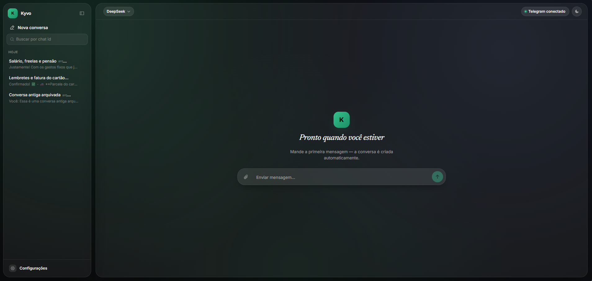

# Kyvo

**Assistente financeiro pessoal com IA, memória de longo prazo e painel web — tudo operado por linguagem natural.**

Mande "gastei 47 reais no ifood" ou "separa 500 pra viagem em dezembro" pelo Telegram e o Kyvo registra, responde e ajuda a planejar. Ele lembra de você entre conversas — preferências, metas, contexto de vida — para dar sugestões que fazem sentido, e nunca deixa a IA inventar um número: toda escrita no banco passa por *tool calls* estruturadas e validadas.

<p align="center">
  
  
  
  
  
  
  
</p>

<p align="center">
  
</p>

---

## Por que o Kyvo é diferente

- 💬 **100% linguagem natural** — registrar gasto, consultar saldo, criar meta, pedir lembrete: tudo em texto corrido.
- 🧠 **Memória de verdade** — perfil pessoal, contexto de vida, preferências e insights persistem entre conversas e moldam as respostas seguintes.
- 🔒 **IA nunca escreve direto no banco** — toda ação passa por *tool calls* validadas; saldo e histórico sempre vêm de query SQL, nunca de "memória aproximada" do modelo.
- 🔁 **Multi-LLM, trocável em runtime** — Claude (Anthropic) e DeepSeek, alternáveis pelo painel web, com API keys cifradas (AES-256-GCM) no Postgres.
- 🎙️ **Multimodal** — texto, imagem, áudio (transcrito via Groq/Whisper) e documentos como anexo, direto pelo Telegram.
- ⏰ **Proativo** — agendamentos (cron) no próprio processo disparam alertas de orçamento estourado, meta com prazo próximo e anomalia de gasto por categoria.
- 🖥️ **Painel web** — chat com histórico, troca de provedor de IA, integrações e configurações, fora do Telegram.
- 🏠 **Self-hostable** — um `docker-compose.yml`, zero segredo no código, roda em qualquer VPS/Fly.io/Railway.

---

## Arquitetura

```
Usuário ⇄ Telegram (webhook) ⇄ app (Fastify) ──tool use──▶ Claude / DeepSeek
                    ▲                │
        painel web (React)           ▼
                    │          Postgres (full-text search nativo)
                    │                ▲
                    └──────────►  scheduler (node-cron, mesmo processo)
                                  ── alertas proativos, consolidação de memória
```

## Telegram

O Telegram é o canal principal do Kyvo — é por lá que o dia a dia acontece, o painel web é só apoio para configuração e histórico.

- **Tudo em linguagem natural.** Sem menus ou sintaxe fixa: "gastei 47 no ifood", "quanto sobrou esse mês", "me lembra de pagar o aluguel dia 5" — o agente interpreta a intenção e chama as *tool calls* certas.
- **Único comando fixo é `/nova`** — começa uma conversa nova sem perder orçamentos, metas ou perfil já registrados.
- **Multimodal nativo** — manda foto de nota fiscal, áudio (transcrito via Groq/Whisper) ou documento (PDF) como anexo, e o Kyvo extrai e registra o que for relevante.
- **Alertas proativos** — o `scheduler` roda dentro do mesmo processo do servidor e o bot avisa sozinho quando um orçamento estoura, uma meta com prazo se aproxima ou aparece um gasto fora do padrão numa categoria.
- **Setup** — token via [@BotFather](https://t.me/BotFather), cadastrado no painel web; o webhook precisa de HTTPS público (reverse proxy com TLS em produção, [ngrok](https://ngrok.com/) para testar local).

---

## Stack

| Camada | Escolha |
|---|---|
| Linguagem/runtime | TypeScript + Node.js 20 |
| Servidor HTTP | Fastify |
| Painel web | React + Vite + Tailwind CSS |
| Banco de dados | PostgreSQL (full-text search nativo, sem embeddings) |
| IA (conversação) | [Claude API](https://www.anthropic.com/api) e DeepSeek, via tool use — trocáveis em runtime |
| Transcrição de áudio | Groq (Whisper) |
| Canal de chat | Telegram Bot API |
| Integração bancária | [Pluggy](https://pluggy.ai/) (Open Finance Brasil) |
| Empacotamento | Docker + Docker Compose |

---

## Rodando localmente com Docker Compose

```bash
cp apps/api/.env.example apps/api/.env
```

Só duas variáveis são obrigatórias:

| Variável | O que é |
|---|---|
| `CONFIG_ENCRYPTION_KEY` | Gere com `openssl rand -hex 32` — cifra as API keys guardadas no banco |
| `ADMIN_PASSWORD` | Senha do painel web (usuário fixo `admin`, HTTP Basic Auth) |

```bash
docker compose --env-file apps/api/.env up --build -d
curl http://localhost:3000/health   # {"status":"ok"}
```

Depois, acesse `http://localhost:3000/` e cadastre por lá: provedor de LLM (Anthropic/DeepSeek), token do Telegram ([@BotFather](https://t.me/BotFather)) e, opcionalmente, a Groq para transcrição de áudio. O Telegram precisa alcançar o `app` via HTTPS público (reverse proxy com TLS em produção, [ngrok](https://ngrok.com/) para testar local).

```bash
docker compose logs -f app       # logs do servidor
docker compose down              # parar tudo (mantém os dados do Postgres)
```

## Desenvolvimento sem Docker

```bash
npm install                        # instala api + web (npm workspaces)
cp apps/api/.env.example apps/api/.env    # ajuste POSTGRES_HOST=localhost
npm run migrate
npm run dev              # servidor com hot-reload (inclui os agendamentos)
```

Painel web em modo dev: `npm run dev:web`.

---

## Estrutura do projeto

```
apps/
  api/
    src/
      db/                        - acesso a dados: transações, orçamentos, metas, lembretes,
                                    perfil/memória (RAG), migrations SQL versionadas
      lib/
        agent.ts, tools.ts        - loop do agente (tool use) e as tools disponíveis
        llm/                      - clientes Anthropic e DeepSeek por trás de uma interface comum
        telegram.ts, storage.ts   - Bot API e anexos
      routes/                     - webhook do Telegram + API do painel /web
      server.ts                   - processo "app" (HTTP), sobe o scheduler no boot
      scheduler.ts                - agendamentos (cron/alertas), roda no mesmo processo
  web/
    src/components/               - chat, provedores de LLM, integrações, configurações
```

Dois pacotes (`apps/api`, `apps/web`) sob um `package.json` raiz com npm workspaces — em runtime é um serviço único: o `apps/api` compilado serve a API, o webhook do Telegram e os arquivos estáticos de `apps/web` compilado (ver `src/routes/admin.ts`).

Schema versionado em `apps/api/src/db/migrations/*.sql`, aplicado automaticamente no boot.

---

## Princípios de design

- **A IA nunca é a fonte de verdade de um número.** Saldo, histórico e totais sempre vêm de uma query determinística.
- **Confirmação proporcional à confiança.** Extração clara é registrada direto; algo ambíguo gera uma pergunta antes de gravar.
- **Memória pessoal tem limites explícitos.** Dados sensíveis (saúde, religião, orientação, política, dados de terceiros) nunca são capturados.
- **Sem infraestrutura desnecessária.** Cada peça nova só entra quando o produto realmente precisa dela.

---

## Licença

[MIT](./LICENSE)
